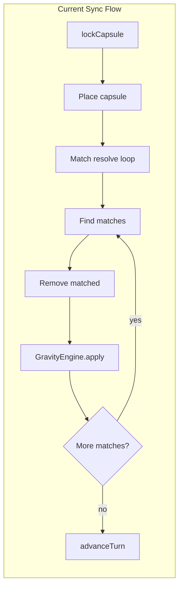
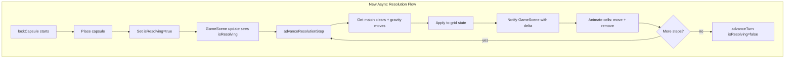

# Gravity Drop Animation Plan

## Next hand off (cut & paste)

**P002 complete.** UI-Test checkpoint passed 2026-02-14. Fixture tests (testGameOverFixtureWin, testGameOverFixtureTie, testGameOverFixtureRestart, testNewGameShowsGameView) passed. Gravity drop animation ready for commit. Optional: add testGravityAnimationVisible or run full playthrough for additional validation.

**Sequence:** G1 done → G2 done → Logic-Test passed → G3 done → G4 done → UI-Test checkpoint done.

## Scope

**Feature:** When the player clears a set (4+ in a row), pips above the match drop slowly with visible animation to their final resting positions instead of the grid updating instantly.

**User-facing outcome:** After a match is cleared, the user sees each falling piece animate downward (e.g. ~0.1–0.15s per row) until the board is stable. Cascading matches (gravity causing new matches) animate step-by-step: clear match → animate drop → repeat.

---

## Current Architecture (Read-Only Findings)

### Resolution Flow




- **[GameState.swift](TableTopGame/Models/GameState.swift)** lines 254–315: `lockCapsule()` runs the full match+gravity loop synchronously. No yielding.
- **[GravityEngine.swift](TableTopGame/Models/GravityEngine.swift)**: `apply(to:)` moves all unsupported pieces down one row per call. Returns `true` if any change.
- **[GameScene.swift](TableTopGame/GameScene.swift)** lines 135–204: `layoutGrid()` removes all grid children and recreates `SKShapeNode` rects from current `gridState`. No persistence; no animation.

### Call Sites


| Caller         | Entry                   | File          |
| -------------- | ----------------------- | ------------- |
| User hard drop | `touchesBegan` top zone | GameScene:110 |
| Auto drop      | `update()` dropInterval | GameScene:90  |
| AI move        | `applyAIMove()`         | GameState:364 |


All paths end at `lockCapsule()` then `layoutGrid()`.

### Confidence

- **Root cause:** 95% — Current design resolves to final state in one synchronous burst; `layoutGrid()` has no before/after data for animation.
- **Solution path:** 90% — Step-wise resolution + persistent cells + `SKAction.move` is a standard approach; integration with GameState and both grids is clear.

---

## Solution Architecture




### Objects


| Object             | Role                                        | Change                                                                                      |
| ------------------ | ------------------------------------------- | ------------------------------------------------------------------------------------------- |
| **GameState**      | Add `isResolving`, step-wise resolution API | New: `beginResolution()`, `advanceResolutionStep() -> ResolutionStep?`                      |
| **ResolutionStep** | Struct describing one animation step        | New type: `cleared: Set<GridPosition>`, `moved: [(col, fromRow, toRow, color)]`             |
| **GravityEngine**  | Return move deltas                          | New: `applyReturningMoves(to:) -> (changed, moves)`                                         |
| **GameScene**      | Persist cells, drive resolution, animate    | Refactor: cell cache `[PlayerColRow: SKShapeNode]`, resolution driver, `SKAction` for moves |
| **GridState**      | Unchanged                                   | No changes                                                                                  |


---

## Decomposition (Build Chunks)

### Phase 1: GravityEngine Delta API

**Chunk G1** – Add `GravityEngine.applyReturningMoves(to:)` that mutates the grid and returns `(changed: Bool, moves: [(col: Int, fromRow: Int, toRow: Int, color: PillColor)])` for each piece that fell one row. Keep existing `apply(to:)` for callers that do not need deltas (e.g. AIController, tests).

**Files:** [GravityEngine.swift](TableTopGame/Models/GravityEngine.swift)

**Validation:** Unit test: given a column with gaps, assert `moves` contains correct (col, fromRow, toRow) pairs; grid state matches `apply(to:)` result.

---

### Phase 2: GameState Step-Wise Resolution

**Chunk G2** – Add resolution state and step API:

1. Add `var isResolving: Bool` (derived or stored); `canAcceptInput` returns `false` when `isResolving`.
2. Add `struct ResolutionStep { let cleared: Set<GridPosition>; let moved: [(col: Int, fromRow: Int, toRow: Int, color: PillColor)] }`.
3. Refactor `lockCapsule()`:
  - Run garbage-insert + resolve (or defer to existing logic) until capsule is placed.
  - After placing capsule: set `isResolving = true`, store resolution context (grid copy, virus positions, `allMatchGroups`, etc.).
4. Add `advanceResolutionStep() -> ResolutionStep?`:
  - Find matches; if any, clear them, record `cleared`, run `GravityEngine.applyReturningMoves`, record `moved`, return `ResolutionStep`.
  - If no matches, run gravity once; if changed, return `ResolutionStep` with `cleared: []` and `moved`.
  - If no matches and no gravity, resolution done: compute attack, game over, `advanceTurn()`, `isResolving = false`, return `nil`.

**Files:** [GameState.swift](TableTopGame/Models/GameState.swift)

**Validation:** Unit test: call `beginResolution()` (or equivalent), then repeatedly `advanceResolutionStep()` until `nil`; final grid must match current synchronous `lockCapsule()` result. Existing `testGameStateTopOutEliminatesPlayerAndOpponentWins` and similar must still pass (use sync path or ensure AI/tests use non-animated completion).

---

### Phase 3: GameScene Cell Persistence and Animation

**Chunk G3** – Refactor `layoutGrid()` and add animation support:

1. **Cell cache:** Maintain `leftCellNodes: [String: SKShapeNode]` and `rightCellNodes: [String: SKShapeNode]` keyed by `"\(col)_\(row)"`. Do not remove-all on each layout when in normal (non-resolving) mode; update positions and colors in place.
2. **Resolution driver:** When `gameState.isResolving`, in `update()`: call `advanceResolutionStep()`. If step returned:
  - For each `cleared` position: find node, run `SKAction.sequence([SKAction.scale(to: 0, duration: 0.05), SKAction.removeFromParent()])`, remove from cache.
  - For each `moved`: find node at (col, fromRow), compute target position in scene coords, run `SKAction.move(to: target, duration: dropDuration)` (e.g. 0.12s), update cache key to (col, toRow).
  - After all animations complete (use `SKAction.run` + completion or counter), call `advanceResolutionStep()` again on next frame or via completion block.
3. **Sync path:** When `!isResolving`, `layoutGrid()` updates from current grid state (create/move/remove nodes to match). For tests or first frame, this is the same as today.

**Files:** [GameScene.swift](TableTopGame/GameScene.swift)

**Constants:** `let dropDuration: TimeInterval = 0.12` (or from SettingsManager later).

**Validation:** Manual: hard drop with a match, observe pips dropping; cascading match animates correctly. Unit tests: no regression on grid appearance (Logic-Test).

---

### Phase 4: Wire Resolution Start and AI

**Chunk G4** – Ensure resolution is triggered and runs to completion: ✅ **Complete 2026-02-14**

1. `lockCapsule()` (or `beginResolution()`) must be invoked from `hardDrop()`, `tryMoveDown()` (when locking), and `applyAIMove()`. **Done:** All three call lockCapsule.
2. For AI: resolution runs with animation (user sees opponent board animate). If `aiDelay` is very low, animations may overlap; acceptable for v1. **Done:** GameScene uses runResolutionSynchronously=false; driveResolutionIfReady animates.
3. Block input and auto-drop during `isResolving`: `canAcceptInput` already false; ensure `update()` does not trigger `tryMoveDown` when resolving. **Done:** update() returns early when isResolving; Logic-Test `testCanAcceptInputFalseWhileResolving` added.

**Files:** [GameState.swift](TableTopGame/Models/GameState.swift), [GameScene.swift](TableTopGame/GameScene.swift), [TableTopGameTests.swift](TableTopGameTests/TableTopGameTests.swift)

**Validation:** opponent’s board animates; turn switches only after resolution completes. Unit tests: 50 pass (incl. testCanAcceptInputFalseWhileResolving). Fixture UI tests pass.

---

## Technical Details

### Position Conversion

Scene position for grid cell `(col, row)` in `playerIndex` grid (same formula as current `layoutGrid`):

```swift
let x = offsetX + cellSize * (CGFloat(col) + 0.5)
let y = offsetY + cellSize * (CGFloat(row) + 0.5)
```

`offsetX`, `offsetY`, `cellSize` are computed in `layoutGrid()`; store or recompute when animating.

### Animation Completion

SpriteKit: `SKAction.run { }` has no completion. Use `SKAction.sequence([moveAction, SKAction.run { onComplete() }])` or track running actions and call `advanceResolutionStep()` when the longest per-step animation finishes. For multiple moves in one step, use `SKAction.group` for parallel moves, then a single `run` to advance.

### Match Clear Animation

Optional brief scale-to-zero (0.05s) for matched cells. If too subtle, can be instant (duration 0). User focus is on the drop.

---

## Risks and Rollback


| Risk                                                | Mitigation                                                                                                   |
| --------------------------------------------------- | ------------------------------------------------------------------------------------------------------------ |
| E2E timing: animations add delay; tests may timeout | Keep `testFullPlaythroughUntilGameOver` timeout (180s or existing); animation total per lock < ~2s typically |
| Cell cache drift if layout changes (rotation, size) | On `didChangeSize`, clear cache and call full `layoutGrid()`                                                 |
| AI + resolution: turn advance before animation done | `advanceTurn()` only when `advanceResolutionStep()` returns `nil`; GameScene drives steps                    |


**Rollback:** Revert to synchronous `lockCapsule()` and stateless `layoutGrid()`. Remove `ResolutionStep`, `applyReturningMoves`, cell caches. Git revert of feature branch.

---

## Validation Strategy

1. **Unit:** `GravityEngine.applyReturningMoves` matches `apply` outcome; `advanceResolutionStep` loop produces same final grid as `lockCapsule`.
2. **Manual:** Hard drop with match → visible drop animation; cascade works.
3. **E2E:** `xcodebuild test` (unit + UI) passes; full playthrough completes.

---

## Master-Plan Registration

Add to [Master-Plan.md](../../Master-Plan.md) matrix:


| Plan ID | Plan name              | Priority rank | Description                                                                                                                     | Current state    |
| ------- | ---------------------- | ------------- | ------------------------------------------------------------------------------------------------------------------------------- | ---------------- |
| P002    | Gravity drop animation | 2             | Animated gravity when matches cleared; pips drop slowly to final position. Plan: `.cursor/Plans/subplans/P002/P002-gravity-animation.plan.md` | Pending analysis |


---

## Infrastructure Additions (infrastructure agent)

**Domain:** CI/CD, test runner, zero-cost deployment.

**Findings:**

- Animation is client-side only; no new server, storage, or paid services. **Zero infrastructure cost.**
- CI (`.github/workflows/test.yml`) runs `xcodebuild test`; `testFullPlaythroughUntilGameOver` is already skipped (long). Viewport-matrix job runs fixture tests only.
- Cell cache adds ~256 SKShapeNodes per grid (8×16×2); negligible memory. No action required.

**Recommendations:**

1. **CI timeout:** If P002 adds full playthrough back to CI, ensure job timeout ≥ 5 min. Current skip of `testFullPlaythroughUntilGameOver` is appropriate; keep it unless explicitly re-enabled.
2. **No new env/config:** Animation duration (`dropDuration`) can stay in code or optional `SettingsManager`; no env vars needed.
3. **Offline:** No change; game remains offline-first.

---

## E2E Harness Additions (e2e-harness agent)

**Domain:** User-journey design, viewport coverage, RPA-friendly objects.

**Journey impact:** The "Play until game over" journey (Launch → Menu → New Game → tap until overlay) is unchanged. Animation adds perceived duration during resolution; no new steps or taps.

**Viewport/device matrix:** Use existing P001 matrix (iPhone SE 3rd gen, iPhone 15 Pro Max, iPad Pro 11). Drop animation must remain visible and legible on all three; no layout change expected.

**User-usable objects:** Grid cells, Restart, Return to Menu—unchanged. Validation: E2E asserts overlay appears; animation completes before overlay is tappable. No new accessibility identifiers.

**Handoffs:**

- **ui-test:** Validate drop animation visible on iPhone SE, 15 Pro Max, iPad Pro 11 after G3/G4. Manual or fixture-based game-over test sufficient.
- **logic-test:** Validate `isResolving` and `advanceResolutionStep` preserve turn/phase invariants (see Logic-Test section).

---

## Logic-Test Additions (logic-test agent)

**Scope:** Move validation, state-machine consistency, turn/phase rules during and after resolution.

**Validation targets:**

1. **`isResolving` invariant:** While `isResolving == true`, `canAcceptInput` must be `false`. No move (left, right, rotate, drop) may be accepted. Trace: `GameScene.touchesBegan`, `update()`—both guard on `canAcceptInput`.
2. **Final state parity:** Loop `advanceResolutionStep()` until `nil`; final `gridStates`, `virusPositionsPerPlayer`, `phase`, `eliminated`, `cash` must match current synchronous `lockCapsule()` result. Unit test: fixture grid → run both paths → assert equality.
3. **Turn advance timing:** `advanceTurn()` only when `advanceResolutionStep()` returns `nil`. No mid-animation turn switch.
4. **Edge cases:** Resolution during garbage insert (trash phase); resolution with simultaneous clear (both players); resolution leading to game over. All must produce correct final phase.

**Existing tests to preserve:** `testGameStateTopOutEliminatesPlayerAndOpponentWins`, `testWinConditionCheckerResolveGameOverLoseScenario`, `testWinConditionCheckerResolveGameOverTie`, `testGravityEngineApply`, `testGravityEngineResolve`. Use sync path (or ensure animated path reaches same outcome) so these pass.

**Completion handoff:** Invoke Investigator to ensure plan has sufficient technical detail for builder.

---

## UI-Test Additions (ui-test agent)

**Context:** Project uses XCUITest (native iOS), not Playwright. Apply UI-test principles to XCUITest.

**Scope:** E2E journeys, layout, contrast, viewport behavior.

**Validation:**

1. **Layout:** Drop animation does not overflow grid bounds. Cells animate within `leftGridFrame` / `rightGridFrame`. No new layout regressions.
2. **Viewports:** Run fixture-based game-over test on iPhone SE, iPhone 15 Pro Max, iPad Pro 11 (existing viewport-matrix CI). If animation is subtle on smallest viewport, note; no change required for v1.
3. **Contrast:** Animation does not affect GameOverOverlay contrast (unchanged).
4. **Efficiency:** Reuse existing `testGameOverFixtureWin`, `testGameOverFixtureTie`; add optional `testGravityAnimationVisible` only if manual validation insufficient—tap until match, assert grid updates within timeout.

**UI-Test checkpoint (2026-02-14):** testGameOverFixtureWin, testGameOverFixtureTie, testGameOverFixtureRestart, testNewGameShowsGameView — all passed. P002 ready for commit.

**Tooling:** XCUITest, `accessibilityIdentifier` where needed. No Playwright.

---

## Tester Additions (tester agent)

**Baseline:** Establish before P002 implementation: run `xcodebuild test` (unit + UI), record pass/fail and duration. Use as regression baseline.

**During implementation:**

- After each chunk (G1–G4): run full suite. If worse than baseline → invoke **Blaster** for regression vs new-bug triage.
- If regressions: revert, annotate plan with watch and mitigation.

**On completion:**

- Update Master-Plan: P002 state → Testing complete when all tests pass.
- Confidence: Root cause and solution path must be ≥90% before marking Validated/Test plan ready.

**Invocation (when tests complete):** "Use the Blaster subagent to analyze and document plan needs for P002 so that root cause and solution path confidence are above 90%."

---

## Planner Additions (planner agent)

**Plan location:** Move/copy plan to `.cursor/Plans/subplans/P002/P002-gravity-animation.plan.md` (workspace) for Master-Plan consistency. Link from matrix.

**Sub-plans:** P002 has 4 chunks (G1–G4); single file acceptable. If plan grows, split into `.cursor/Plans/subplans/P002/G1-gravity-delta.plan.md`, etc.

**Test checkpoint delegation:**

- **Logic-Test:** After G2. Validate `advanceResolutionStep` loop parity and `isResolving` invariants.
- **UI-Test:** After G3/G4. Validate drop animation visible, E2E full playthrough still passes.

**Handoff update (post-agent review):**

- Lane A: Implement Chunk G1; then G2; then Logic-Test checkpoint; then G3, G4; then UI-Test checkpoint.
- Ensure Investigator validation (90%+ confidence) before advancing to Test plan ready.

---

## Cross-Agent Review (Second Pass)

**Triggered by:** Infrastructure, E2E-harness, Logic-Test, UI-Test, Tester, Planner additions.

**Changes identified:**

1. **E2E timing → Infrastructure:** Confirmed. CI already skips long playthrough; no change. If playthrough re-enabled later, timeout ≥5 min.
2. **Logic-Test → Planner:** Added explicit Logic-Test delegation after G2. Planner handoff updated.
3. **UI-Test viewport → E2E-harness:** Aligned. Both reference iPhone SE, 15 Pro Max, iPad Pro 11. No conflict.
4. **Tester baseline → All:** Baseline established before P002. Regressions invoke Blaster.
5. **Plan file path:** Planner notes move to `.cursor/Plans/subplans/P002/P002-gravity-animation.plan.md` for matrix consistency.
6. **Confidence gates:** Planner and Tester both require 90%+ before advancing. Investigator invoked at validation checkpoints.

**No additional changes required** after cross-agent review; plan is consistent.

---

## Next Hand Off (Cut and Paste)

**Investigator/Planner:** Validate this plan for 90%+ confidence. Then implement Chunk G1 (GravityEngine delta API). Plan: [P002-gravity-animation.plan.md](.cursor/Plans/subplans/P002/P002-gravity-animation.plan.md). Expected outcome: `GravityEngine.applyReturningMoves` exists and is unit tested; no behavior change to existing callers. Agent: Investigator for validation; builder for implementation.

**Sequence (after validation):** G1 → G2 → Logic-Test checkpoint → G3 → G4 → UI-Test checkpoint. Establish test baseline before G1.